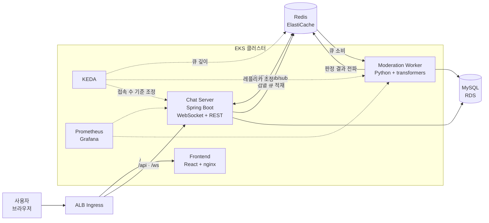
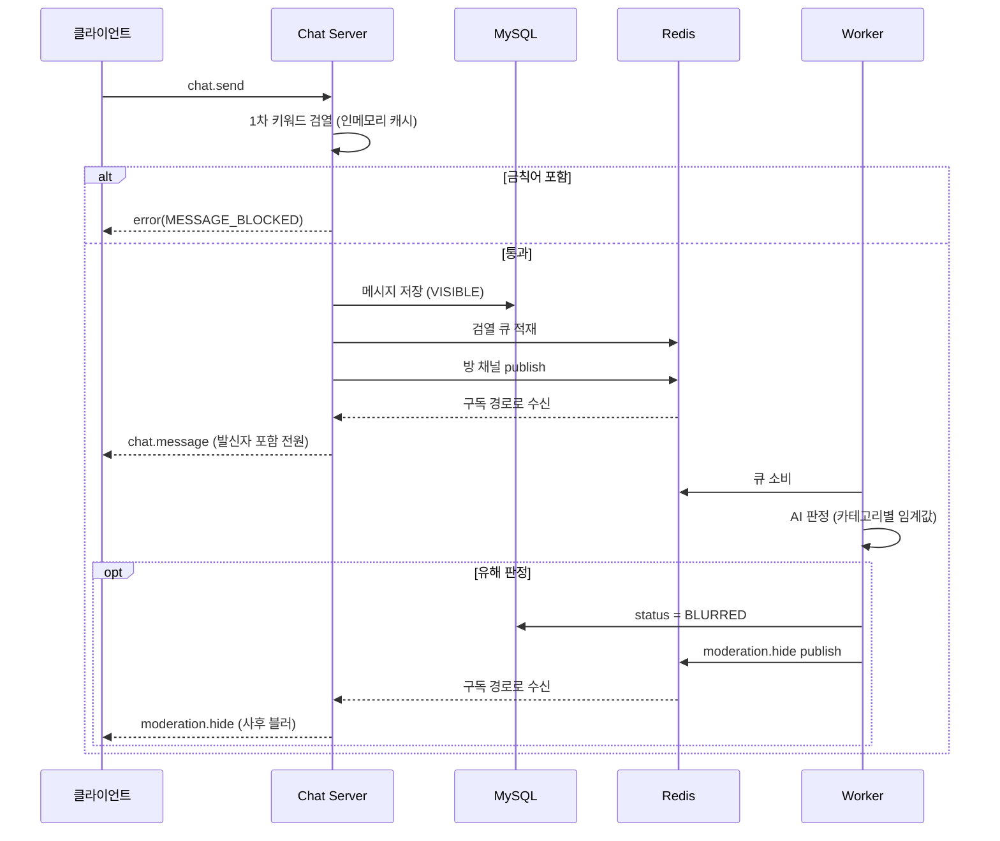

# ChatGuard

> 라이브 채팅과 AI 콘텐츠 모더레이션을 결합한 실시간 서비스.
> Kubernetes 위에 구축하고, **트래픽 폭주와 장애 상황에서의 동작을 실측으로 검증**했습니다.

라이브 스트리밍 플랫폼의 채팅 기능에서 착안해, 스트리밍을 제외한 실시간 채팅과 유해 메시지 모더레이션만을 구현했습니다. 키워드 기반 동기 차단(즉시)과 AI 모델의 비동기 판정(사후 블러)을 2단계로 결합한 구조입니다.

- **기간** 2026.06 ~ 2026.07 (5주) · **팀** 5명
- **담당** 인프라 · 배포 파이프라인 · 관측성 · 부하/장애 테스트 · 설계 문서
- **환경** AWS EKS (dev / prod 2개 환경)

| | |
|---|---|
| Frontend | React 19 · Vite |
| Backend | Java 17 · Spring Boot 3.5 · WebSocket · Flyway |
| Worker | Python 3.11 · transformers · PyTorch (CPU) |
| Data | MySQL (RDS) · Redis (ElastiCache) |
| Infra | Terraform · EKS 1.35 · ArgoCD · KEDA · External Secrets · ALB Controller |
| Observability | Prometheus · Grafana · Alertmanager · k6 |

---

## 목차

- [아키텍처](#아키텍처)
- [메시지 처리 흐름](#메시지-처리-흐름)
- [담당 범위](#담당-범위)
- [부하·장애 테스트](#부하장애-테스트)
- [설계 의사결정](#설계-의사결정)
- [한계와 다음 단계](#한계와-다음-단계)
- [레포지토리](#레포지토리)

---

## 아키텍처

**설계 포인트**

- **Chat Server는 상태를 갖지 않는다.** 어느 파드에 붙어도 같은 방의 메시지를 받도록 Redis pub/sub으로 fan-out. 참여자 목록과 채팅 정지 상태도 Redis에 두어 파드 간 공유.
- **검열은 2단계로 분리.** 즉시 차단이 필요한 키워드는 동기 처리(메시지당 DB 조회 없이 인메모리 캐시), 무거운 AI 판정은 큐를 통해 비동기 처리. 전송 응답 시간이 모델 추론 시간에 묶이지 않는다.
- **오토스케일 신호를 컴포넌트별로 다르게.** 워커는 검열 큐 깊이, Chat Server는 WebSocket 접속 수(Prometheus 메트릭). 각 컴포넌트가 실제로 포화되는 원인을 신호로 삼았다.
- **외부 진입은 ALB가 경로로 분기.** 정적 파일은 nginx 파드, `/api`·`/ws`는 Chat Server로 직접 라우팅. 리버스 프록시를 한 단계 걷어내 ALB가 개별 파드를 직접 인지하게 만든 것이 스케일 동작(연결 분산·드레인)의 전제가 되었다.

---

## 메시지 처리 흐름

**순서에 담긴 의도**

- **저장 → 큐 적재 → 전파** 순서를 고정했다. 큐 적재에 실패하면 전파하지 않고 오류를 반환한다. 순서를 바꾸면 "화면에는 보이는데 영원히 검열되지 않는 메시지"가 생기는데, 검열 서비스에서 이건 최악의 실패 모드다.
- **발신자에게도 구독 경로로만 전달한다.** 로컬에서 바로 밀어주면 자기 메시지가 두 번 보일 수 있어, 모든 전달 경로를 하나로 통일했다.
- **워커는 DB 상태를 먼저 갱신한 뒤 이벤트를 발행한다.** 재접속 시 클라이언트가 히스토리의 `status`를 진실원으로 삼아 블러 상태를 복원할 수 있다.

---

## 담당 범위

5인 팀에서 **인프라·배포·운영·테스트 계층 전반**과 설계 문서를 담당했습니다. 애플리케이션의 주요 기능 구현은 팀원이 맡았고, 저는 컴포넌트 간 인터페이스 정의와 통합, 배포 과정에서 필요한 수정에 참여했습니다.

| 영역 | 담당 |
|---|---|
| 설계 명세서 | 작성·운영, 주요 의사결정 59건 기록 |
| 코드리뷰 자동화 | 문서 기반 AI 리뷰 파이프라인 구축 |
| CI/CD · GitOps | 전담 (OIDC, 멀티아치 빌드, ArgoCD, prod 승격 게이트) |
| 인프라 | dev 인수 후 운영, prod 환경 전체 구축, HA 구성 |
| 관측성 | 전담 (Prometheus / Grafana / Alertmanager) |
| 부하·장애 테스트 | 전담 (시나리오 설계 · 실행 · 분석 · 기록) |
| 애플리케이션 | 부분 기여 (WebSocket 핸드셰이크 검증, 히스토리 조회, 통합 이슈 수정 등) |

---

## 부하·장애 테스트

접속 수와 메시지 처리량을 **별도 축으로 분리**해 변인을 통제하고, 총 9회의 실험을 진행했습니다. 목표는 절대 수치가 아니라 **오토스케일이 설계대로 동작하는지, 시스템의 한계가 어디인지**를 확인하는 것이었습니다.

### 병목은 파드 수가 아니라 노드였다

메시지 폭주 실험에서 워커가 2→5대로 확장됐지만 처리량이 27 ops/s에서 멈췄습니다. 워커 상한이 병목이라 판단해 **max를 10으로 올렸는데, 처리량이 오르지 않았습니다.**

| | 워커 5 · 노드 3 | 워커 10 · 노드 3 | **워커 10 · 노드 5** |
|---|---|---|---|
| 총 처리량 | 27 ops/s | 22~25 ops/s | **43 ops/s (+72%)** |
| 파드당 처리량 | 5.4 /s | 2.3 /s | **4.3 /s** |
| 모델 추론 p95 | 420 ms | 700 ms | **450 ms** |
| 큐 피크 | 20,000 | 20,000 | **9,600** |

파드를 2배로 늘렸는데 총 처리량이 그대로이고 개별 추론은 오히려 느려졌다는 것은, 워커들이 **유한한 공유 자원을 나눠 쓰고 있다**는 신호였습니다. 노드 CPU를 실측하니 3대 전부 0.97~0.99로 포화 상태였습니다.

노드를 3→5로 증설하고 **동일한 부하 프로파일로 재측정**해 처리량 +72%를 확인했습니다. 그리고 세 실험의 (파드당 가용 코어, 파드당 처리량) 쌍이 거의 선형이라는 것도 함께 확인됐습니다.

> **처리량 ≈ 워커가 실제로 확보한 코어 총량 × 코어당 4.5~5.4 msg/s**

"워커를 몇 개 띄울까"가 아니라 "워커가 코어를 몇 개 쥐는가"가 처리량을 결정한다는 것, 그리고 **파드 오토스케일은 노드 용량 안에서만 유효하다**는 것이 이 실험의 결론입니다. 이 모델로 목표 처리량에서 필요한 노드 수를 역산할 수 있게 됐습니다.

### 용량 이내에서는 목표를 충족한다

실측 용량(43 ops/s) 아래로 부하를 낮춰 재측정했습니다.

| 지표 | 목표 | 실측 |
|---|---|---|
| 검열 반영 지연 p95 | < 5 s | **< 1 s** |
| 메시지 전송 지연 p95 | < 300 ms | **40 ms** |
| 전송 성공률 | ≥ 99.9% | **100%** |

같은 실험에서 워커가 10 → 4로 스스로 축소했다가, 큐가 다시 오르자 즉시 10으로 재확장하는 전 사이클도 관측됐습니다.

### 장애 주입: 진짜 원인은 Redis가 아니었다

Redis를 2노드 + 자동 failover로 구성하고 primary를 강제 종료했습니다. **복제본 승격은 정상**이었지만, 그 사이 **Chat Server 3파드가 전원 재시작**됐습니다.

로그를 따라가니 원인은 Redis가 아니었습니다.

1. primary가 교체됐는데 Redis 클라이언트가 DNS 캐시 때문에 죽은 옛 주소로 계속 재접속을 시도
2. 그 동안 앱의 헬스체크 응답이 최대 40초간 지연 (Redis 상태 확인에서 대기)
3. Kubernetes의 liveness 프로브가 이 헬스체크를 1초 타임아웃으로 검사 → 3회 실패 → **"앱이 죽었다"고 판단하고 재시작**
4. 그런데 Redis 클라이언트는 **44초 만에 스스로 재접속에 성공**했다

즉 몇 초만 더 기다렸으면 살았을 파드를, 프로브가 먼저 죽인 것입니다. 같은 장애를 겪은 워커는 재시작이 0이었는데, 워커의 프로브는 의존성을 보지 않는 단순 생존 체크였기 때문입니다. 이 대비가 원인을 확정해줬습니다.

**조치** — liveness는 프로세스 생존만 보는 경량 엔드포인트로 분리하고, 의존성 상태는 readiness에만 반영. Redis 응답 대기는 3초로 제한하고, 프로브 타임아웃도 앱의 응답 상한에 맞춰 조정.

| | 조치 전 | 조치 후 |
|---|---|---|
| 동일 failover 재주입 | 3파드 전원 재시작 | **재시작 0회** |
| 노드 강제 종료 | — | **재시작 0회, 약 3분 내 자동 복구** |

| 조치 전 — 3파드 동시 재시작 | 조치 후 — 평평한 0 |
|---|---|
|  |  |

재접속에 걸린 시간은 조치 전후 모두 약 40초로 같습니다. 이 조치는 **복구를 빠르게 한 것이 아니라, 복구를 기다리는 동안 죽지 않게 한 것**입니다.

### 한계 상황에서의 동작

- **접속 천장 초과** — 설계 천장(1,000 연결)을 넘는 부하에서 시스템은 정확히 1,000에서 멈췄고, 초과 요청은 재시도 유도 응답으로 거절됐습니다. 서버 재시작 0, 입장한 사용자의 전송 지연 40~55ms 유지. 거절된 연결도 backoff 후 전원 입장에 성공했습니다.

- **연결 상한의 근거화** — 만석 상태의 파드 메모리를 실측해(455MiB / 1Gi, 연결당 약 150KB) 잠정값이던 상한 200의 근거를 확보했습니다.
- **극한 과부하** — 실측 용량의 11.6배 부하에서 무너진 컴포넌트가 없었고, 포화된 것은 노드 CPU 하나였습니다. DB 커넥션 60/85, Redis CPU 8.9%.

- **메시지 유실 0** — 부하 종료 후 송신(k6) / 저장(DB) / 검열(로그) 건수를 3자 대조했습니다. **36,215 / 36,214 / 36,214**, DLQ 0건. 차이 1건은 부하 종료 순간 연결이 닫히며 마지막 메시지가 도달하지 못한 경계 사건입니다.

---

## 설계 의사결정

주요 결정을 **채택안 · 검토한 대안 · 근거** 형식으로 기록했습니다. 일부만 옮기면:

| 결정 | 채택 | 근거 |
|---|---|---|
| 검열 큐 구현 | Redis List | fan-out용 Redis가 이미 필수라 추가 인프라 없음. 견고성이 필요하면 Streams/SQS로 확장 |
| AI 모델 호스팅 | 워커 프로세스 내 로드 | 작은 CPU 모델이라 스케일 단위가 워커 하나로 명확해짐 |
| 적재·전파 순서 | 저장 → 큐 → 전파 | 순서를 바꾸면 "노출됐으나 미검열" 상태가 가능. 비용 0으로 실패 모드를 무해한 쪽으로 이동 |
| 금칙어 관리 | DB + 파드 캐시 + pub/sub 무효화 | 메시지당 DB 조회를 피해 전송 지연 목표를 보호하면서 런타임 편집 가능 |
| 워커 신뢰성 | processing 큐 + 재시도 + DLQ + 시작 시 복구 | 단순 pop은 프로세스가 강제 종료되면 처리 중이던 작업이 증발 |
| 노드 인스턴스 | t → m 계열 전환 | t 계열의 CPU 크레딧 소진이 "앱의 한계"와 "크레딧의 한계"를 섞어 측정을 오염시킴 |

전체 기록은 [DESIGN.md](https://github.com/CLD-05/team1-chatguard-context/blob/main/DESIGN.md)의 결정 기록 절에 있습니다.

---

## 한계와 다음 단계

**측정된 범위** — 실측 처리량은 초당 40여 건 수준으로, 실제 라이브 스트리밍 서비스의 규모와는 거리가 있습니다. 이번 테스트의 목적도 절대 수치가 아니라 오토스케일 동작과 병목 위치의 확인이었습니다. DB와 Redis가 "여유"였다는 판정 역시 측정한 부하 범위 내에서의 결론입니다.

**다음 실험** — 확장 한계가 노드 컴퓨트 총량으로 좁혀졌으므로, 다음은 노드를 증설하고 부하를 높여 그 다음 병목을 확인하는 것입니다. 커넥션 수가 `chat 파드 × 10 + 워커 파드 × 1`로 계산되는 모델이 서로 다른 부하 조건에서 두 번 적중했고, 이 모델대로면 chat이 8파드를 넘는 시점에 DB 커넥션 상한(85)에 도달합니다. 커넥션 풀 확대는 이 상한과 트레이드오프 관계라 함께 검토해야 합니다.

**개발 환경의 제약** — 공유 AWS 계정에서 비용을 절감하기 위해 매일 아침 dev·prod 리소스를 생성하고 일과 종료 시 전부 삭제하는 사이클로 개발했습니다. 그래서 매일 바뀌는 엔드포인트 일부가 매니페스트에 직접 기재된 채 남아 있습니다. External Secrets를 구성해 두었으므로, 상시 운영되는 환경이라면 시크릿과 함께 외부화했어야 할 부분입니다.

**미적용 항목** — TLS 미구성(도메인·인증서 미할당), 클라이언트 재접속 UX 검증, 알람 규칙 확충. 각각 프로젝트 기간 내 우선순위 판단에 따라 의도적으로 남겨둔 항목입니다.

---

## 레포지토리

팀 레포 4개로 구성되어 있습니다. 환경은 브랜치가 아니라 디렉터리·오버레이·이미지 태그로 구분합니다.

| 레포 | 내용 |
|---|---|
| [context](https://github.com/CLD-05/team1-chatguard-context) | 설계 명세서, 실험 기록, 팀 규칙 |
| [app](https://github.com/CLD-05/team1-chatguard-app) | React · Spring Boot · Python Worker, Dockerfile, CI |
| [config](https://github.com/CLD-05/team1-chatguard-config) | Kubernetes 매니페스트, ArgoCD, KEDA |
| [infra](https://github.com/CLD-05/team1-chatguard-infra) | Terraform (modules + envs/dev · envs/prod) |

**바로 보기**

- [DESIGN.md](https://github.com/CLD-05/team1-chatguard-context/blob/main/DESIGN.md) — 컴포넌트 책임, 데이터 모델, 메시지 스키마, 의사결정 기록 59건
- [load-test/](https://github.com/CLD-05/team1-chatguard-context/tree/main/load-test) — 실험별 조건 · 관측 · 결론
- [captures/](https://github.com/CLD-05/team1-chatguard-context/tree/main/load-test/captures) — 부하·장애 테스트 Grafana 캡처
- [제 PR 목록](https://github.com/search?q=org%3ACLD-05+is%3Apr+author%3Ajotace06&type=pullrequests) — 4개 레포 전체
