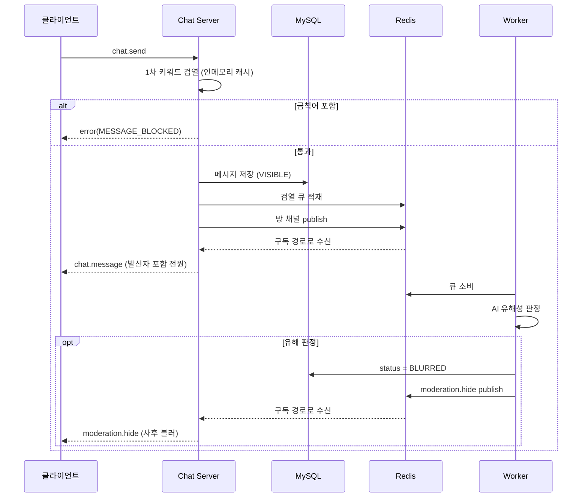

# ChatGuard

> 라이브 채팅과 AI 콘텐츠 모더레이션을 결합한 실시간 서비스.
> Kubernetes 위에 구축하고, **트래픽 폭주와 장애 상황에서의 동작을 실측으로 검증**했습니다.

라이브 스트리밍 플랫폼의 채팅 기능에서 착안해, 스트리밍을 제외한 실시간 채팅과 유해 메시지 모더레이션만을 구현했습니다. 키워드 기반 동기 차단(즉시)과 AI 모델의 비동기 판정(사후 블러)을 2단계로 결합한 구조입니다.

- **기간** 2026.06 ~ 2026.07 (5주) · **팀** 5명
- **담당** 인프라 · 배포 파이프라인 · 관측성 · 부하·장애 테스트 · 설계 문서
- **환경** AWS EKS (dev / prod 2개 환경)

| 영역 | 스택 |
|---|---|
| Frontend | React 19 · Vite |
| Backend | Java 17 · Spring Boot 3.5 · WebSocket · Flyway |
| Worker | Python 3.11 · transformers · PyTorch (CPU) |
| Data | MySQL (RDS) · Redis (ElastiCache) |
| Infra | Terraform · EKS 1.35 · ArgoCD · KEDA · External Secrets · ALB Controller |
| Observability | Prometheus · Grafana · Alertmanager · k6 |

---

## 목차

- [배포 구조](#배포-구조)
- [파드가 여러 대인데 메시지는 어떻게 모두에게 가는가](#파드가-여러-대인데-메시지는-어떻게-모두에게-가는가)
- [무엇을 보고 얼마나 늘리는가](#무엇을-보고-얼마나-늘리는가)
- [메시지 한 건의 처리 순서](#메시지-한-건의-처리-순서)
- [담당 범위](#담당-범위)
- [부하·장애 테스트](#부하장애-테스트)
- [설계 의사결정](#설계-의사결정)
- [한계와 다음 단계](#한계와-다음-단계)
- [레포지토리](#레포지토리)

---

## 배포 구조

3개 가용영역에 걸친 VPC 안에서, 서브넷을 노출 수준에 따라 세 층으로 나눴습니다. 외부에서 닿을 수 있는 것은 퍼블릭 서브넷의 ALB 하나뿐이고, 애플리케이션 파드는 프라이빗 서브넷에, 데이터베이스와 Redis는 **인터넷으로 나가는 라우트가 아예 없는** 격리 서브넷에 둡니다.

**설계 포인트**

- **Chat Server는 상태를 갖지 않습니다.** 어느 파드에 붙어도 같은 방의 메시지를 받도록 Redis pub/sub으로 전파하고, 참여자 목록과 채팅 정지 상태도 Redis에 둡니다.
- **검열을 동기와 비동기로 쪼갰습니다.** 즉시 차단할 키워드는 인메모리 캐시에서 동기 처리하고, 무거운 AI 판정은 큐로 넘깁니다. 전송 응답 시간이 모델 추론에 묶이지 않습니다.
- **오토스케일 신호를 컴포넌트별로 다르게 잡았습니다.** 워커는 검열 큐의 길이, Chat Server는 WebSocket 접속 수를 봅니다([아래에서 자세히](#무엇을-보고-얼마나-늘리는가)).
- **ALB가 경로로 직접 분기합니다.** 원래는 nginx 파드가 `/api`·`/ws`를 받아 뒤로 넘기는 구조였는데, 그러면 ALB에게 보이는 대상은 nginx 하나뿐이라 Chat Server 파드가 몇 개인지 알 수 없습니다. 새 연결을 한산한 파드로 보내는 분산도, 줄어드는 파드의 연결을 미리 빼는 드레인도 ALB가 개별 파드를 알아야 작동합니다. 그래서 nginx는 정적 파일만 맡겼습니다.

### dev / prod 차이

같은 Terraform 모듈에 변수만 다르게 넣어 두 환경을 만들었습니다. prod는 HA 구조를 갖추되 인스턴스는 최소 사양으로 잡았습니다.

| | dev | prod |
|---|---|---|
| AZ / NAT | 2 AZ · NAT 1대 | 3 AZ · AZ마다 NAT |
| EKS 노드 | t4g.medium × 2 | m7g.large × 5 |
| Chat Server | min 1 / max 5 | min 3 / max 5 |
| Worker | min 1 / max 5 | min 2 / max 10 |
| RDS | db.t4g.micro, 단일 AZ, 백업 없음 | db.t4g.small, Multi-AZ, 백업 7일 |
| Redis | cache.t4g.micro 1노드 | cache.t4g.small 2노드, 자동 failover |
| 배포 | main 머지 시 자동 | 승인 게이트 통과 후, dev에서 검증된 이미지를 재빌드 없이 승격 |

---

## 파드가 여러 대인데 메시지는 어떻게 모두에게 가는가

같은 방에 있는 사용자라도 붙어 있는 파드는 제각각입니다. 사용자 A의 메시지를 받은 것은 파드 1뿐이고, 파드 2는 그런 메시지가 있었는지도 모릅니다. 이 문제를 Redis가 풉니다.

- **메시지를 받은 파드는 자기 클라이언트에게 바로 밀지 않습니다.** 대신 방 채널에 publish하고, 구독 중인 모든 파드가 그걸 받아 각자에게 붙은 클라이언트에게 전달합니다. 발신자인 A도 이 경로로 자기 메시지를 돌려받습니다. 전달 경로가 하나뿐이라 같은 메시지가 두 번 보일 일이 없습니다.
- **같은 Redis가 성격이 다른 두 가지 일을 합니다.** 위쪽은 pub/sub이라 구독자 전원에게 복사되고, 아래쪽은 List라서 하나의 작업을 하나의 워커만 가져갑니다. 채팅은 모두에게 퍼져야 하고 검열은 한 번만 하면 되므로, 필요한 성질이 정반대입니다.
- **그래서 두 계층이 따로 스케일됩니다.** 큐가 채팅 경로와 분리돼 있어, AI 판정이 밀려도 채팅 전송은 영향을 받지 않고 워커만 독립적으로 늘어납니다.

---

## 무엇을 보고 얼마나 늘리는가

두 컴포넌트는 포화되는 이유가 다릅니다. Chat Server는 연결을 붙들고 있느라 메모리가 차고, 워커는 추론하느라 CPU가 찹니다. 그래서 CPU 사용률 같은 공통 지표 대신, 각자가 실제로 포화되는 원인을 신호로 삼았습니다.

- **접속 축** — Prometheus에 쌓인 WebSocket 접속 수 합계를 KEDA가 직접 조회해, 파드당 100 연결을 기준으로 레플리카를 정합니다. 여기에 파드당 200 연결이라는 하드 상한이 별도로 걸려 있어, 스케일이 못 따라가도 한 파드가 메모리로 무너지지는 않습니다.
- **처리량 축** — Redis 검열 큐의 길이를 보고 파드당 5건을 기준으로 워커를 늘립니다. 큐 깊이는 "밀린 일감"을 그대로 나타내는 값이라 지연이 커지기 전에 신호가 먼저 움직입니다.
- **확장은 빠르게, 축소는 느리게.** 양쪽 모두 늘릴 때는 대기 없이 즉시 올리고, 줄일 때는 10분 안정화 구간을 둡니다. 워커는 모델을 프로세스 안에 올리기 때문에 새 파드의 콜드스타트 비용이 크고, Chat Server는 파드가 사라질 때마다 그 파드에 붙어 있던 연결이 한꺼번에 재접속을 시도하기 때문입니다.

두 축을 분리했기 때문에 부하 테스트도 접속 수와 메시지 처리량을 따로 밀어서 진행했습니다. 한 번에 둘 다 극한으로 밀면 어느 쪽이 병목인지 구분되지 않습니다.

---

## 메시지 한 건의 처리 순서

| 단계 | 처리 방식 | 사용자가 보는 것 |
|---|---|---|
| 1차 · 키워드 | 동기, 인메모리 캐시 조회 | 전송 즉시 차단, 발신자에게만 오류 표시 |
| 정상 전파 | 저장 → 큐 적재 → publish | 같은 방 전원에게 노출 |
| 2차 · AI | 비동기, 큐 소비 후 판정 | 잠시 뒤 해당 메시지가 블러 처리 |

**순서에 담긴 의도**

- **저장 → 큐 적재 → 전파.** 큐 적재에 실패하면 전파하지 않고 오류를 반환합니다. 순서를 바꾸면 "화면에는 보이는데 영원히 검열되지 않는 메시지"가 생기는데, 검열 서비스에서 이건 최악의 실패 모드입니다.
- **워커는 DB 상태를 먼저 갱신한 뒤 이벤트를 발행합니다.** 블러 이벤트는 그 순간 접속해 있는 클라이언트만 받으므로, 잠깐 끊겨 있던 사용자는 놓칩니다. 이들은 재접속할 때 히스토리를 다시 받아 화면을 맞추는데, DB의 `status`가 이미 갱신돼 있어야 놓친 블러가 복원됩니다. 순서가 반대면 그 틈에 재접속한 사용자에게는 유해 메시지가 그대로 남습니다.
- **1차 검열은 단순 문자열 대조가 아닙니다.** 한글 금칙어는 숫자·공백·특수문자를 걷어내고 분리된 자모를 완성형으로 재결합한 뒤 대조해, 우회 표현을 함께 잡습니다.

---

## 담당 범위

5인 팀에서 **인프라·배포·운영·테스트 계층 전반**과 설계 문서를 담당했습니다. 애플리케이션의 주요 기능 구현은 팀원이 맡았고, 저는 컴포넌트 간 인터페이스를 정의하고 통합·배포 과정에서 드러난 결함을 수정했습니다.

| 영역 | 담당 |
|---|---|
| 설계 명세서 | 작성·운영, 주요 의사결정 59건 기록 |
| 구현 감사 | 명세 대비 결함 20건을 심각도별로 등급화해 8건의 PR로 해소 |
| 코드리뷰 자동화 | 문서 기반 AI 리뷰 파이프라인 구축 |
| CI/CD · GitOps | 전담 (OIDC, 멀티아치 빌드, ArgoCD, prod 승격 게이트) |
| 인프라 | dev 운영, prod 환경 전체 구축, Terraform 모듈 HA 변수화 |
| 관측성 | 전담 (Prometheus / Grafana / Alertmanager) |
| 부하·장애 테스트 | 전담 (시나리오 설계 · 실행 · 분석 · 기록) |
| 애플리케이션 | 부분 구현 (WebSocket 핸드셰이크 인증·에러 분리, 히스토리 조회 버그, ping heartbeat 등) |

---

## 부하·장애 테스트

접속 수와 메시지 처리량을 **별도 축으로 분리**해 변인을 통제하고, prod 환경에서 총 9회의 실험을 진행했습니다. 목표는 절대 수치가 아니라 **오토스케일이 설계대로 동작하는지, 시스템의 한계가 어디인지**를 확인하는 것이었습니다.

### 병목은 파드 수가 아니라 노드였다

메시지 폭주 실험에서 워커가 2→5대로 확장됐지만 처리량이 27 ops/s에서 멈췄습니다. 워커 상한이 병목이라 판단해 max를 10으로 올렸는데, **처리량이 오히려 27에서 22~25 ops/s로 떨어졌습니다.**

| | 워커 5 · 노드 3 | 워커 10 · 노드 3 | **워커 10 · 노드 5** |
|---|---|---|---|
| 총 처리량 | 27 ops/s | 22~25 ops/s | **43 ops/s (+72%)** |
| 파드당 처리량 | 5.4/s | 2.3/s | **4.3/s** |
| 모델 추론 p95 | 420 ms | 700 ms | **450 ms** |
| 큐 피크 | 20,000 | 20,000 | **9,600** |

파드를 2배로 늘렸는데 총 처리량이 되레 줄고 개별 추론은 느려졌다는 것은, 워커들이 **유한한 공유 자원을 나눠 쓰고 있다**는 신호였습니다. 노드 CPU를 재보니 3대 모두 사용률 97~99%로 포화 상태였습니다.

이 과정에서 측정 자체를 한 번 의심해야 했습니다. 처음 뽑은 워커 CPU가 파드당 1.25코어였는데, 10파드면 12.5코어로 클러스터 총량을 넘는 값이라 물리적으로 불가능했습니다. 쿼리에 `container` 라벨을 걸지 않아 파드 cgroup 합계와 컨테이너 값이 이중으로 잡히고 있었고, 교정 후 0.55코어가 나왔습니다.

노드를 3→5로 증설하고 **동일한 부하 프로파일로 재측정**해 처리량 +72%를 확인했습니다. 세 실험에서 파드가 실제로 쓴 CPU로 그 파드의 처리량을 나눠보니, 파드 수와 노드 수가 달랐는데도 코어당 4.5~5.4 msg/s라는 좁은 범위에 모였습니다. 코어당 처리 능력은 일정하고, 달라진 것은 워커 전체가 쥘 수 있는 코어 총량뿐이었다는 뜻입니다.

> **처리량 ≈ 워커가 실제로 확보한 코어 총량 × 코어당 4.5~5.4 msg/s**

"워커를 몇 개 띄울까"가 아니라 "워커가 코어를 몇 개 쥐는가"가 처리량을 결정한다는 것, 그리고 **파드 오토스케일은 노드 용량 안에서만 유효하다**는 것이 이 실험의 결론입니다. 이 모델로 목표 처리량에서 필요한 노드 수를 역산할 수 있게 됐습니다.

### 용량 이내에서는 목표를 충족한다

실측 용량(43 ops/s) 아래로 부하를 낮춰 재측정했습니다.

| 지표 | 목표 | 실측 |
|---|---|---|
| 검열 반영 지연 p95 | < 5 s | **< 1 s** |
| 메시지 전송 지연 p95 | < 300 ms | **40 ms** |
| 전송 성공률 | ≥ 99.9% | **100%** |

*큐가 차오르자 워커가 늘고, 검열 지연이 목표 아래로 돌아온다.*

같은 실험에서 워커가 10 → 4로 스스로 축소했다가, 큐가 다시 오르자 즉시 10으로 재확장하는 전 사이클도 관측됐습니다. 이때 검열 큐 적체 경보(`ModerationQueueBacklog`)가 실제로 발화했고, 오토스케일이 큐를 따라잡으면서 10분 뒤 스스로 해소됐습니다. 알람을 걸어두기만 한 것이 아니라 발화와 해소를 한 사이클 관측한 셈입니다.

### 장애 주입: 진짜 원인은 Redis가 아니었다

Redis를 2노드 + 자동 failover로 구성하고 primary를 강제 종료했습니다. **복제본 승격은 정상**이었지만, 그 사이 **Chat Server 3파드가 전원 재시작**됐습니다.

로그를 따라가니 원인은 Redis가 아니었습니다.

1. primary가 교체됐는데 Redis 클라이언트가 DNS 캐시 때문에 죽은 옛 주소로 계속 재접속을 시도
2. 그 동안 앱의 헬스체크 응답이 최대 40초간 지연 (Redis 상태 확인에서 대기)
3. Kubernetes의 liveness 프로브가 이 헬스체크를 1초 타임아웃으로 검사 → 3회 실패 → **"앱이 죽었다"고 판단하고 재시작**
4. 그런데 Redis 클라이언트는 **44초 만에 스스로 재접속에 성공**

즉 몇 초만 더 기다렸으면 살았을 파드를, 프로브가 먼저 죽인 것입니다. 같은 장애를 겪은 워커는 재시작이 0이었는데, 워커의 프로브는 의존성을 보지 않는 단순 생존 체크였기 때문입니다. 이 대비가 원인을 확정해줬습니다.

**조치** — liveness는 프로세스 생존만 보는 경량 엔드포인트로 분리하고, 의존성 상태는 readiness에만 반영. Redis 응답 대기는 3초로 제한하고, 프로브 타임아웃도 앱의 응답 상한에 맞춰 조정.

| | 조치 전 | 조치 후 |
|---|---|---|
| 동일 failover 재주입 | 3파드 전원 재시작 | **재시작 0회** |
| 노드 강제 종료 | — | **재시작 0회, 약 3분 내 자동 복구** |

| 조치 전 — 3파드 동시 재시작 | 조치 후 — 평평한 0 |
|---|---|
|  |  |

재접속에 걸린 시간은 조치 전후 모두 약 40초로 같습니다. 이 조치는 **복구를 빠르게 한 것이 아니라, 복구를 기다리는 동안 죽지 않게 한 것**입니다.

### 한계 상황에서의 동작

**접속 천장 초과** — Chat Server는 파드당 연결 200개를 상한으로 두고, prod에서 최대 5파드까지 확장되므로 설계 천장은 1,000 연결입니다. 이를 넘기는 부하에서 접속 수는 정확히 1,000에서 멈췄고, 초과 연결 11,418건은 "잠시 후 재시도" 신호로 거절됐습니다. 서버 재시작 0회, 이미 입장한 사용자의 전송 지연은 40~55ms를 유지했고, 거절된 연결도 backoff 후 전원 입장에 성공했습니다.

*파드마다 상한 200에서 수평선을 그린다. 넘긴 요청은 거절되고 재시도로 흡수됐다.*

**연결 상한 200의 근거 확보** — 만석 상태 파드의 메모리를 실측해(455MiB / 1Gi, 연결당 약 150KB) 잠정값이던 상한을 확정했습니다.

**극한 과부하** — 실측 용량의 11.6배 부하에서 무너진 컴포넌트가 없었고, 포화된 것은 노드 CPU 하나였습니다. DB 커넥션 60/85, Redis CPU 8.9%.

*실측 용량의 11.6배 부하. 천장에 닿은 것은 노드 CPU 하나뿐.*

**메시지 유실 0** — 부하 종료 후 송신(k6) / 저장(DB) / 검열(로그) 건수를 3자 대조했습니다. **36,215 / 36,214 / 36,214**, DLQ 0건. 차이 1건은 부하 종료 순간 연결이 닫히며 마지막 메시지가 도달하지 못한 경계 사건입니다.

---

## 설계 의사결정

주요 결정을 **채택안 · 검토한 대안 · 근거** 형식으로 기록했습니다. 일부만 옮기면:

| 결정 | 채택 | 근거 |
|---|---|---|
| 검열 큐 구현 | Redis List | fan-out용 Redis가 이미 필수라 추가 인프라 없음. 견고성이 필요하면 Streams/SQS로 확장 |
| AI 모델 호스팅 | 워커 프로세스 내 로드 | 작은 CPU 모델이라 스케일 단위가 워커 하나로 명확해짐 |
| 적재·전파 순서 | 저장 → 큐 → 전파 | 순서를 바꾸면 "노출됐으나 미검열" 상태가 가능. 비용 0으로 실패 모드를 무해한 쪽으로 이동 |
| 금칙어 관리 | DB + 파드 캐시 + pub/sub 무효화 | 메시지당 DB 조회를 피해 전송 지연 목표를 보호하면서 런타임 편집 가능 |
| 워커 신뢰성 | processing 큐 + 재시도 + DLQ + 시작 시 복구 | 단순 pop은 프로세스가 강제 종료되면 처리 중이던 작업이 증발 |
| prod 노드 인스턴스 | t 계열 → m 계열 | t 계열은 평소 성능을 크레딧으로 쌓아뒀다가 부하 때 당겨 쓰므로, 처리량 저하가 앱의 한계인지 크레딧 소진인지 구분되지 않아 측정에서 이 변수를 제거 |

전체 기록은 [DESIGN.md](https://github.com/CLD-05/team1-chatguard-context/blob/main/DESIGN.md)의 결정 기록 절에 있습니다.

---

## 한계와 다음 단계

**측정된 범위** — 실측 처리량은 초당 40여 건 수준으로, 실제 라이브 스트리밍 서비스의 규모와는 거리가 있습니다. 이번 테스트의 목적도 절대 수치가 아니라 오토스케일 동작과 병목 위치의 확인이었습니다. DB와 Redis가 "여유"였다는 판정 역시 측정한 부하 범위 내에서의 결론입니다.

**검증되지 않은 경로** — 워커의 재시도·DLQ·시작 시 복구는 구현돼 있지만, 실험 중 DLQ로 이동한 작업이 한 건도 없었고 이 경로를 강제로 재현하는 테스트도 작성하지 않았습니다. "DLQ 0건"은 해당 경로가 검증됐다는 뜻이 아니라 발화할 일이 없었다는 뜻입니다. 장애를 주입해 확인해야 할 다음 항목입니다.

**다음 실험** — 확장 한계가 노드 컴퓨트 총량으로 좁혀졌으므로, 다음은 노드를 증설하고 부하를 높여 그 다음 병목을 확인하는 것입니다. 관측된 DB 커넥션 수가 `chat 파드 × 10 + 워커 파드 × 1`로 설명된다는 것을 서로 다른 부하 조건에서 두 번 확인했는데, 이 계수는 관측에서 역산한 값이고 애플리케이션 설정으로 명시된 값은 아닙니다(둘 다 커넥션 풀 크기를 기본값에 맡기고 있습니다). 모델대로면 chat이 8파드를 넘는 시점에 인스턴스의 커넥션 상한(85)에 닿으므로, 커넥션 풀을 명시적으로 고정하는 것과 함께 검토해야 합니다.

**개발 환경의 제약** — 공유 AWS 계정에서 비용을 절감하기 위해 매일 아침 dev·prod 리소스를 생성하고 일과 종료 시 전부 삭제하는 사이클로 개발했습니다. 그래서 매일 바뀌는 엔드포인트(DB·Redis 주소)가 prod 매니페스트에 평문으로 남아 있습니다. External Secrets는 구성해 두었고 dev는 전 항목이 Secrets Manager 경유이므로, 상시 운영되는 환경이라면 prod도 같은 방식으로 외부화했어야 할 부분입니다.

**미적용 항목** — TLS 미구성(도메인·인증서 미할당), Slack 알림이 prod에만 배선됨, 클라이언트 재접속 UX 검증. 각각 프로젝트 기간 내 우선순위 판단에 따라 의도적으로 남겨둔 항목입니다.

---

## 레포지토리

팀 레포 4개로 구성되어 있습니다. 환경은 브랜치가 아니라 디렉터리·오버레이·이미지 태그로 구분합니다.

| 레포 | 내용 |
|---|---|
| [context](https://github.com/CLD-05/team1-chatguard-context) | 설계 명세서, 실험 기록, 팀 규칙 |
| [app](https://github.com/CLD-05/team1-chatguard-app) | React · Spring Boot · Python Worker, Dockerfile, CI |
| [config](https://github.com/CLD-05/team1-chatguard-config) | Kubernetes 매니페스트, ArgoCD, KEDA |
| [infra](https://github.com/CLD-05/team1-chatguard-infra) | Terraform (modules + envs/dev · envs/prod) |

**바로 보기**

- [DESIGN.md](https://github.com/CLD-05/team1-chatguard-context/blob/main/DESIGN.md) — 컴포넌트 책임, 데이터 모델, 메시지 스키마, 의사결정 기록 59건
- [load-test/](https://github.com/CLD-05/team1-chatguard-context/tree/main/load-test) — 실험별 조건 · 관측 · 결론
- [captures/](https://github.com/CLD-05/team1-chatguard-context/tree/main/load-test/captures) — 부하·장애 테스트 Grafana 캡처
- [제 PR 목록](https://github.com/search?q=org%3ACLD-05+is%3Apr+author%3Ajotace06&type=pullrequests) — 4개 레포 전체
