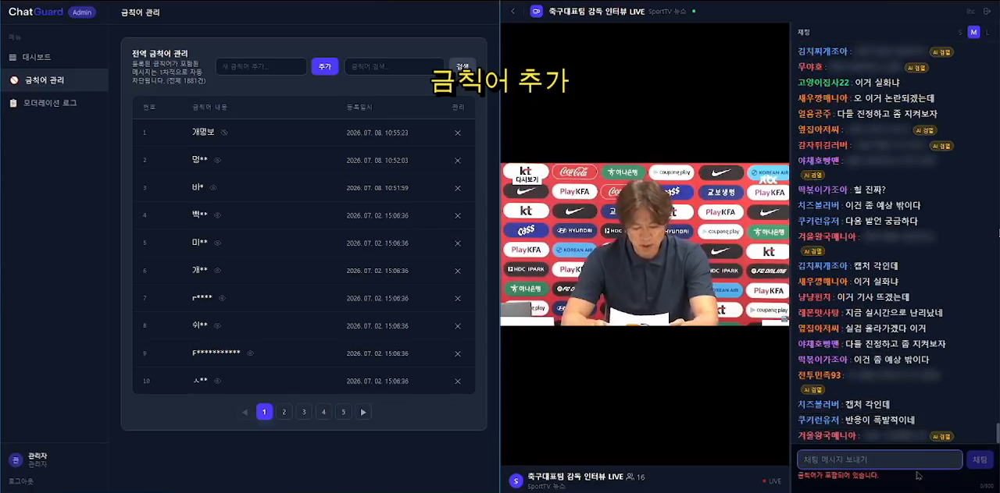
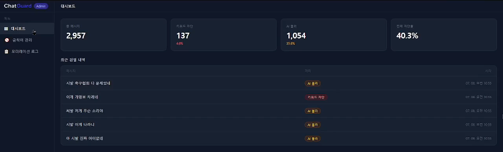
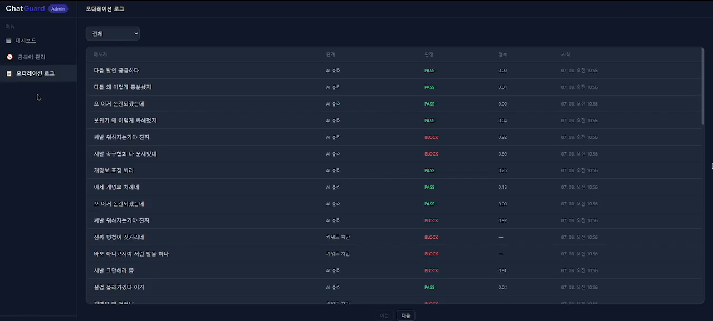
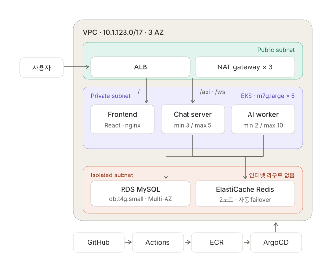
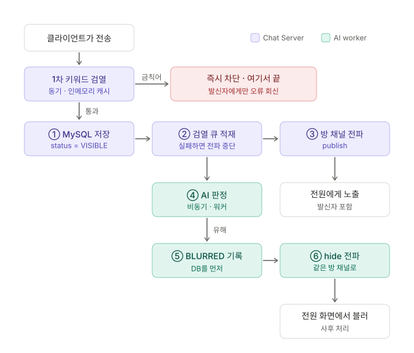
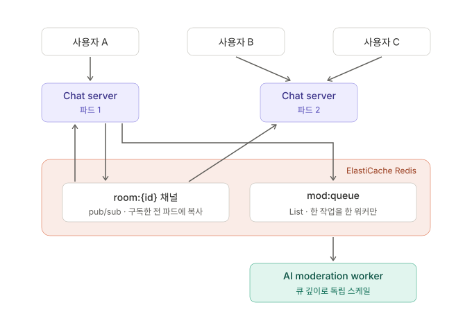
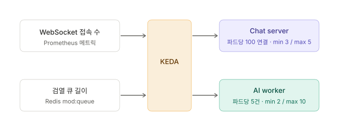

# ChatGuard

> 라이브 채팅과 AI 콘텐츠 모더레이션을 결합한 실시간 서비스.
> Kubernetes 위에 구축하고, **트래픽 폭주와 장애 상황에서의 동작을 실측으로 검증**했습니다.

---

## 어떤 서비스인가

라이브 스트리밍 채팅은 방송의 재미를 키우는 공간이지만, 동시에 악성 채팅이 끊이지 않는 곳이기도 합니다. 명백한 비속어는 키워드로 걸러낼 수 있지만 자모를 분리하거나 기호를 끼워 넣어 우회하는 채팅, 맥락 속에서 공격하는 채팅은 잡기 어렵습니다. **실시간성을 해치지 않으면서 이런 채팅을 어떻게 걸러낼 것인가**에서 출발한 프로젝트입니다.

영상 송출은 범위에서 제외하고 채팅에 집중했습니다. 들어오는 모든 채팅을 두 단계로 검열해, 명백한 금칙어는 전파 전에 차단하고 맥락상 유해한 메시지는 AI가 판정해 가립니다. 운영자는 금칙어를 실시간으로 추가하거나 방 전체 채팅을 일시 정지할 수 있습니다.

_트래픽이 몰리는 구간. 통과한 메시지는 그대로 노출되고, AI가 유해로 판정한 메시지는 가려진 채 표시된다._

### 검열은 두 단계로

|        | 1단계 · 키워드                           | 2단계 · AI                  |
| ------ | ---------------------------------------- | --------------------------- |
| 언제   | 노출 **전**에 동기 검사                  | 노출 **후**에 비동기 판정   |
| 무엇을 | 비속어·혐오 표현, 자모 분리 등 우회 표현 | 맥락으로 판단해야 하는 표현 |
| 결과   | 즉시 차단, 발신자에게만 오류             | 사후 블러                   |

실시간성을 지키기 위해 **먼저 보여주고, 위험하면 가린다**를 택했습니다. 전송이 AI 판정을 기다리지 않으므로, 응답 시간이 모델 추론 시간에 묶이지 않습니다.

| 측정 구간                                     | 실측 p95     |
| --------------------------------------------- | ------------ |
| 전송 — 메시지를 보내고 화면에 뜨기까지        | **40ms**     |
| 검열 반영 — 큐에 들어가고 블러가 전파되기까지 | **1초 미만** |

전송이 판정을 기다렸다면 앞의 숫자가 뒤의 숫자보다 작을 수 없습니다.

### 운영자 화면

<b>금칙어 관리 · 대시보드 · 모더레이션 로그 (펼쳐보기)</b>

 

**금칙어 실시간 추가** — 관리자가 추가한 단어가 전파되어, 다른 사용자가 같은 단어를 입력하자 바로 차단됩니다. 금칙어는 DB에 두고 각 파드가 메모리에 들고 있다가, 변경 신호를 받으면 다시 읽습니다. 메시지마다 DB를 조회하지 않으면서도 런타임 편집이 가능합니다.

**대시보드** — 총 메시지, 키워드 차단 수, AI 블러 수, 전체 차단율과 최근 검열 내역.

**모더레이션 로그** — 단계(키워드/AI), 판정, AI 점수, 시각. 단계별 필터링이 가능합니다.

---

## 프로젝트 개요

- **기간** 2026.06 ~ 2026.07 (5주) · **팀** 5명
- **담당** 인프라 · 배포 파이프라인 · 관측성 · 부하·장애 테스트 · 설계 문서 ([상세](#담당-범위))
- **환경** AWS EKS (dev / prod 2개 환경)
- **시연 영상** [전체 보기](https://www.youtube.com/watch?v=Rs1L9nQpcWU) — 채팅 전파, 2단계 검열, 금칙어 실시간 추가, 채팅 정지, 관리자 대시보드

| 영역          | 스택                                                                     |
| ------------- | ------------------------------------------------------------------------ |
| Frontend      | React 19 · Vite                                                          |
| Backend       | Java 17 · Spring Boot 3.5 · WebSocket · Flyway                           |
| Worker        | Python 3.11 · transformers · PyTorch (CPU)                               |
| Data          | MySQL (RDS) · Redis (ElastiCache)                                        |
| Infra         | Terraform · EKS 1.35 · ArgoCD · KEDA · External Secrets · ALB Controller |
| Observability | Prometheus · Grafana · Alertmanager · k6                                 |

---

## 목차

- [어떤 서비스인가](#어떤-서비스인가)
- [배포 구조](#배포-구조)
- [핵심 동작](#핵심-동작)
  - [흩어진 파드에 어떻게 동시에 전달하나](#흩어진-파드에-어떻게-동시에-전달하나)
  - [느린 AI 검열이 채팅을 막지 않으려면](#느린-ai-검열이-채팅을-막지-않으려면)
  - [이미 노출된 메시지를 어떻게 가리나](#이미-노출된-메시지를-어떻게-가리나)
- [무엇을 보고 얼마나 늘리는가](#무엇을-보고-얼마나-늘리는가)
- [부하·장애 테스트](#부하장애-테스트)
- [담당 범위](#담당-범위)
- [설계 의사결정](#설계-의사결정)
- [한계와 다음 단계](#한계와-다음-단계)
- [레포지토리](#레포지토리)

---

## 배포 구조

3개 가용영역에 걸친 VPC 안에서, 서브넷을 노출 수준에 따라 세 층으로 나눴습니다. 외부에서 닿을 수 있는 것은 퍼블릭 서브넷의 ALB 하나뿐이고, 애플리케이션 파드는 프라이빗 서브넷에, 데이터베이스와 Redis는 **인터넷으로 나가는 라우트가 아예 없는** 격리 서브넷에 둡니다.

- **외부에서 들어오는 요청은 ALB가 경로로 나눕니다.** `/`는 정적 파일을 서빙하는 nginx 파드로, `/api`와 `/ws`는 Chat Server로 **직접** 보냅니다. nginx가 백엔드 요청까지 받아 넘기는 구성이 더 흔하지만, 그러면 ALB에게 보이는 대상이 nginx 하나뿐이라 Chat Server가 몇 개로 늘었는지 알 수 없습니다. 새 연결을 한산한 파드로 보내는 일도, 종료될 파드의 연결을 미리 빼는 일도 ALB가 개별 파드를 알아야 가능합니다. 한번 맺으면 오래 유지되는 WebSocket에서는 연결되는 순간의 분산이 사실상 유일한 기회입니다.
- **데이터 계층은 인터넷과 끊어져 있습니다.** RDS와 Redis가 있는 격리 서브넷에는 NAT도 인터넷 게이트웨이도 연결돼 있지 않습니다. 애플리케이션 파드가 있는 프라이빗 서브넷은 이미지를 받아야 해서 NAT로 나가지만, 데이터 계층은 나갈 일이 없으므로 경로 자체를 만들지 않았습니다.

<b>dev / prod 환경 차이</b>

 

두 환경은 같은 Terraform 모듈을 쓰고 변수만 다릅니다. 환경을 브랜치로 나누지 않고 디렉터리와 변수로 분리했기 때문에, 한쪽에만 적용된 수정이 생기지 않습니다.

dev는 매일 만들고 지우는 환경이라 **비용과 생성 속도**를 우선했습니다. AZ 하나에 NAT 한 대, 단일 AZ DB, 복제본 없는 Redis입니다. prod는 **구조적으로 HA를 갖추되 인스턴스 크기는 최소**로 잡았습니다. 장애 주입 실험에서 "AZ 하나가 죽어도 살아남는가"를 확인하려면 다중화가 실제로 돼 있어야 하는데, 그건 구성의 문제지 인스턴스 사양의 문제가 아니기 때문입니다.

|             | dev                              | prod                                                          |
| ----------- | -------------------------------- | ------------------------------------------------------------- |
| AZ / NAT    | 2 AZ · NAT 1대                   | 3 AZ · AZ마다 NAT                                             |
| EKS 노드    | t4g.medium × 2                   | m7g.large × 5                                                 |
| Chat Server | min 1 / max 5                    | min 3 / max 5                                                 |
| Worker      | min 1 / max 5                    | min 2 / max 10                                                |
| RDS         | db.t4g.micro, 단일 AZ, 백업 없음 | db.t4g.small, Multi-AZ, 백업 7일                              |
| Redis       | cache.t4g.micro 1노드            | cache.t4g.small 2노드, 자동 failover                          |
| 배포        | main 머지 시 자동                | 승인 게이트 통과 후, dev에서 검증된 이미지를 재빌드 없이 승격 |

---

## 핵심 동작

메시지 한 건은 두 갈래로 끝날 수 있습니다. 명백한 금칙어는 전파되기 전에 끝나고, 통과한 메시지는 일단 노출된 뒤 AI 판정 결과에 따라 사후에 가려질 수 있습니다.

이 흐름을 만들면서 풀어야 했던 문제가 세 가지였습니다.

### 흩어진 파드에 어떻게 동시에 전달하나

WebSocket은 한 번 맺으면 끊을 때까지 유지되는 연결입니다. 사용자 A가 접속하면 그 연결은 **A를 받아준 파드 하나의 메모리 안에** 객체로 남습니다. A에게 무언가를 보내려면 그 객체를 가진 파드가 직접 써야 합니다. 다른 파드는 A가 존재한다는 사실조차 모릅니다.

서버가 한 대일 때는 문제가 없습니다. 모든 연결이 그 한 대 안에 있으니 목록을 순회하며 쓰면 끝입니다. 그런데 파드를 여러 개로 늘리면 같은 방 사람들이 서로 다른 파드에 흩어집니다. A의 메시지를 받은 파드 1은 파드 2에 붙어 있는 B와 C에게 전달할 방법이 없습니다.

**파드끼리 직접 연락하는 방법은 택하지 않았습니다.** 파드 1이 파드 2에게 "이 메시지 좀 전해줘"라고 하려면 지금 살아 있는 파드가 몇 개이고 각각 어디 있는지 알아야 합니다. 오토스케일로 파드가 수시로 생기고 사라지는 환경에서 그 목록을 정확히 유지하는 것 자체가 또 하나의 문제입니다.

**대신 Redis를 중계소로 두고, 모든 파드가 그곳을 바라보게 했습니다.** 메시지를 받은 파드는 Redis에 던져 넣기만 합니다. 누가 듣고 있는지 알 필요가 없습니다. Redis는 그것을 듣고 있던 모든 파드에게 복사해 보내고, 각 파드는 자기 메모리에 있는 WebSocket 연결로 내보냅니다. 이 방식이 **pub/sub**이고, 던져 넣는 주소를 **채널**이라고 부릅니다.

- **채널은 만드는 것이 아니라 이름만 맞추면 됩니다.** 보내는 쪽이 `room:1`이라는 이름으로 던지고 받는 쪽이 같은 이름을 듣고 있으면 성립합니다. 방이 새로 생겨도 Redis에 등록할 것이 없습니다.
- **채널 이름에 방 번호를 넣어 구분합니다.** 이름이 하나뿐이면 1번 방 메시지가 2번 방 사람에게도 갑니다. 1번 방 메시지는 `room:1`로만 나갑니다.
- **받는 쪽은 `room:*` 하나로 전부 듣고, 받은 뒤에 거릅니다.** 방마다 구독을 붙였다 떼는 대신, 모든 파드가 모든 방의 메시지를 받아 자기한테 그 방 사용자가 있을 때만 전달하는 방식입니다. 구독 관리 코드가 없어 단순하고 방이 수십 개인 지금은 버려지는 양이 무의미하지만, 수천 개가 되면 모든 파드가 모든 트래픽을 받게 되므로 그때는 방별 구독으로 바꿔야 합니다.
- **발신자도 Redis를 거쳐 자기 메시지를 돌려받습니다.** 파드 1이 A에게 곧바로 밀어주는 편이 한 단계 빠르지만, 그러면 전달 경로가 둘이 되어 같은 메시지가 두 번 보일 수 있습니다. 모든 전달을 한 경로로 통일했습니다.
- **던진 메시지는 남지 않습니다.** 그 순간 듣고 있던 파드에만 복사되고 사라집니다. 그래서 전파와 저장이 짝을 이룹니다. 지금 보고 있는 사람은 Redis에서 받고, 나중에 들어온 사람은 DB에서 읽습니다.

**메시지 브로커를 따로 두지 않은 이유.** 여러 수신자에게 동시에 뿌리는 문제는 Kafka나 RabbitMQ 같은 전용 브로커, AWS라면 SNS·SQS 조합으로도 풀 수 있습니다. 이들은 메시지를 보관해 두었다가 못 받은 쪽에 다시 주는 보장이 강한 대신, 구성 요소가 하나 더 늘고 파드마다 자기 큐나 컨슈머 그룹을 들고 있어야 합니다. 파드가 수시로 생기고 사라지는 환경에서는 그 관리가 또 일이 됩니다.

Redis pub/sub은 반대로 **보낸 순간 듣고 있지 않았으면 그만**입니다. 보장이 약한 대신 가볍습니다. 이 서비스에서는 이 약점이 치명적이지 않았습니다. 메시지의 원본은 DB에 있고, 연결이 끊겼던 사용자는 재접속하면서 히스토리를 다시 받아 화면을 맞추기 때문입니다. 실시간 전파는 "지금 보고 있는 사람에게 빠르게"만 하면 되고, 정확성은 DB가 책임집니다.

결정적으로 **Redis는 이미 필요했습니다.** AI 검열 대기열과 참여자 목록을 둘 곳이 있어야 했으니까요. 위 그림에서 파드 1이 Redis로 보내는 화살표가 둘인데, 하나는 방금의 채널이고 다른 하나는 검열 대기열입니다. 채널은 듣고 있는 **모두에게 복사**되고, 대기열은 **한 작업을 한 워커만** 가져갑니다. 성질이 정반대인 두 문제를 같은 저장소의 다른 자료구조로 풀었기 때문에, 전파를 위해 인프라를 추가하지 않았습니다.

### 느린 AI 검열이 채팅을 막지 않으려면

두 가지 요구가 맞섭니다. 채팅은 즉시 떠야 하는데, AI 판정은 모델이 문장을 읽는 동안 수백 밀리초가 걸립니다. 모든 메시지를 판정한 뒤에 보여주면 전송 지연이 모델 추론 시간에 그대로 묶입니다. 그래서 검열을 성격에 따라 둘로 쪼갰습니다.

|            | 언제 검사   | 기다리나           | 무엇을 잡나                  |
| ---------- | ----------- | ------------------ | ---------------------------- |
| 1차 키워드 | 노출 **전** | 기다림 (즉시 끝남) | 명백한 금칙어와 그 우회 표현 |
| 2차 AI     | 노출 **후** | 기다리지 않음      | 문맥으로 판단해야 하는 표현  |

**1차는 단순 문자열 비교가 아닙니다.** 금칙어 사이에 숫자나 기호를 끼워 넣거나 자모를 분해해 적는 우회가 흔합니다. 그래서 한글 메시지는 한글이 아닌 문자를 걷어내고, 분리된 자모를 완성형 글자로 다시 조합한 뒤에 대조합니다. 금칙어 목록은 각 파드가 메모리에 들고 있어서 메시지마다 DB를 조회하지 않고, 관리자가 목록을 바꾸면 신호를 받아 다시 읽습니다.

**둘 사이를 잇는 것이 큐입니다.** Chat Server는 워커에게 직접 요청하지 않고 Redis의 목록에 일감을 넣은 뒤 곧장 다음 메시지를 처리하러 갑니다. 워커는 그 줄에서 하나씩 꺼내 처리합니다. 이렇게 두면 두 가지를 얻습니다. 워커가 느려져도 채팅 전송은 영향을 받지 않고, 폭주가 와도 일감이 사라지지 않고 줄에 쌓여 차례를 기다립니다. 그리고 쌓인 길이가 곧 "얼마나 밀렸는가"라서, 이 값을 [오토스케일의 신호](#무엇을-보고-얼마나-늘리는가)로 그대로 씁니다.

**적재와 전파의 순서를 고정했습니다.** 1차 검열을 통과한 메시지는 ① DB에 저장하고 ② 검열 큐에 넣은 뒤 ③ 전파합니다. 큐에 넣는 데 실패하면 전파하지 않고 발신자에게 오류를 돌려줍니다.

순서가 중요한 이유는 실패했을 때 남는 상태가 달라지기 때문입니다. 전파를 먼저 하고 큐에 넣다가 실패하면, 그 메시지는 **모두의 화면에 떠 있는데 AI 검열은 영원히 받지 않는 상태**가 됩니다. 검열 서비스에서 가장 나쁜 결과입니다. 순서를 바꾸면 같은 실패가 "아무에게도 안 보였고 다시 보내면 됨"으로 바뀝니다. 코드에서 두 줄의 순서를 바꾸는 것이 전부였습니다.

다만 이것으로 구멍이 완전히 막히지는 않습니다. 저장이 큐 적재보다 먼저이므로, 큐 적재가 실패한 메시지는 **DB에는 남은 채 검열을 받지 않습니다.** 실시간으로 보고 있던 사람에게는 전파되지 않지만, 나중에 접속해 히스토리를 불러오는 사람에게는 보입니다. 저장과 큐 적재를 하나의 트랜잭션으로 묶어야 완전히 막히는데, 프로젝트 범위에서는 과하다고 보고 노출 범위를 줄이는 선에서 멈췄습니다.

### 이미 노출된 메시지를 어떻게 가리나

워커가 "이 메시지는 유해하다"고 판정했을 때, 그 메시지는 이미 여러 파드에 흩어진 여러 화면에 떠 있습니다. 앞의 전파 문제와 같은 모양이라 해법도 같습니다.

- **같은 채널을 그대로 씁니다.** 채팅 메시지가 지나가던 그 방 채널에 "이 메시지를 가려라"라는 신호를 흘려보냅니다. 구독 중인 모든 파드가 받아 각자의 클라이언트에 전달하고, 브라우저가 해당 메시지를 찾아 블러 처리합니다. 전파 장치를 새로 만들 필요가 없었습니다.
- **어느 메시지인지는 ID로 지목합니다.** Chat Server는 메시지를 받자마자 고유 ID를 발급해 저장·큐·전파에 모두 같은 값을 씁니다. 그래서 판정이 끝난 시점에 "그 ID의 메시지"라고만 말하면 됩니다.
- **DB를 먼저 바꾸고 신호를 보냅니다.** 신호는 그 순간 접속해 있는 사람만 받습니다. 잠깐 끊겼던 사람은 재접속하면서 히스토리를 다시 받는데, 그때 DB가 이미 갱신돼 있어야 놓친 블러가 복원됩니다. 순서가 반대라면 그 틈에 들어온 사람에게는 유해 메시지가 그대로 보입니다.
- **화면은 DB의 상태값 하나만 보고 그립니다.** 프론트엔드가 "가려야 할 메시지 목록"을 따로 들고 있지 않습니다. 실시간 신호로 받든 히스토리로 받든 같은 값을 보기 때문에 두 경로가 어긋나지 않습니다.

---

## 무엇을 보고 얼마나 늘리는가

두 컴포넌트는 포화되는 이유가 다릅니다. Chat Server는 연결을 붙들고 있느라 메모리가 차고, 워커는 추론하느라 CPU가 찹니다. 그래서 CPU 사용률 같은 공통 지표 대신, 각자가 실제로 포화되는 원인을 신호로 삼았습니다.

- **접속 축** — Prometheus에 쌓인 WebSocket 접속 수 합계를 KEDA가 직접 조회해, 파드 하나가 100 연결을 맡는 기준으로 레플리카를 정합니다. 접속이 320명이면 4개가 됩니다. 여기에 파드당 200 연결이라는 하드 상한이 별도로 걸려 있어, 스케일이 못 따라가도 한 파드가 메모리로 무너지지는 않습니다.
- **처리량 축** — 앞서 본 검열 큐의 길이를 보고 워커를 늘립니다. 파드 하나가 대기열 5건을 맡는다고 보고 `큐 길이 ÷ 5`만큼 띄우므로, 50건이 쌓이면 10개가 됩니다. 큐 깊이는 밀린 일감을 그대로 나타내는 값이라 지연이 커지기 전에 신호가 먼저 움직입니다.
- **확장은 빠르게, 축소는 느리게.** 양쪽 모두 늘릴 때는 대기 없이 즉시 올리고, 줄일 때는 10분 안정화 구간을 둡니다. 워커는 모델을 프로세스 안에 올리기 때문에 새 파드의 콜드스타트 비용이 크고, Chat Server는 파드가 사라질 때마다 그 파드에 붙어 있던 연결이 한꺼번에 재접속을 시도하기 때문입니다.
- **상한에 닿으면 더 늘지 않습니다.** 워커는 10개, Chat Server는 5개가 끝입니다. 그 위로는 큐가 쌓이거나 새 연결이 거절되는데, 두 상황 모두 부하 테스트에서 실제로 관측했습니다.

두 축을 분리했기 때문에 부하 테스트도 접속 수와 메시지 처리량을 따로 밀어서 진행했습니다. 한 번에 둘 다 극한으로 밀면 어느 쪽이 병목인지 구분되지 않습니다.

---

## 부하·장애 테스트

접속 수와 메시지 처리량을 **별도 축으로 분리**해 변인을 통제하고, prod 환경에서 총 9회의 실험을 진행했습니다. 목표는 절대 수치가 아니라 **오토스케일이 설계대로 동작하는지, 시스템의 한계가 어디인지**를 확인하는 것이었습니다.

### 병목은 파드 수가 아니라 노드였다

메시지 폭주 실험에서 워커가 2→5대로 확장됐지만 처리량이 27 ops/s에서 멈췄습니다. 워커 상한이 병목이라 판단해 max를 10으로 올렸는데, **처리량이 오히려 27에서 22~25 ops/s로 떨어졌습니다.**

|               | 워커 5 · 노드 3 | 워커 10 · 노드 3 | **워커 10 · 노드 5** |
| ------------- | --------------- | ---------------- | -------------------- |
| 총 처리량     | 27 ops/s        | 22~25 ops/s      | **43 ops/s (+72%)**  |
| 파드당 처리량 | 5.4/s           | 2.3/s            | **4.3/s**            |
| 모델 추론 p95 | 420 ms          | 700 ms           | **450 ms**           |
| 큐 피크       | 20,000          | 20,000           | **9,600**            |

파드를 2배로 늘렸는데 총 처리량이 되레 줄고 개별 추론은 느려졌다는 것은, 워커들이 **유한한 공유 자원을 나눠 쓰고 있다**는 신호였습니다. 노드 CPU를 재보니 3대 모두 사용률 97~99%로 포화 상태였습니다.

이 과정에서 측정 자체를 한 번 의심해야 했습니다. 처음 뽑은 워커 CPU가 파드당 1.25코어였는데, 10파드면 12.5코어로 클러스터 총량을 넘는 값이라 물리적으로 불가능했습니다. 쿼리에 `container` 라벨을 걸지 않아 파드 cgroup 합계와 컨테이너 값이 이중으로 잡히고 있었고, 교정 후 0.55코어가 나왔습니다.

노드를 3→5로 증설하고 **동일한 부하 프로파일로 재측정**해 처리량 +72%를 확인했습니다. 세 실험에서 파드가 실제로 쓴 CPU로 그 파드의 처리량을 나눠보니, 파드 수와 노드 수가 달랐는데도 코어당 4.5~5.4 msg/s라는 좁은 범위에 모였습니다. 코어당 처리 능력은 일정하고, 달라진 것은 워커 전체가 쥘 수 있는 코어 총량뿐이었다는 뜻입니다.

> **처리량 ≈ 워커가 실제로 확보한 코어 총량 × 코어당 4.5~5.4 msg/s**

"워커를 몇 개 띄울까"가 아니라 "워커가 코어를 몇 개 쥐는가"가 처리량을 결정한다는 것, 그리고 **파드 오토스케일은 노드 용량 안에서만 유효하다**는 것이 이 실험의 결론입니다. 이 모델로 목표 처리량에서 필요한 노드 수를 역산할 수 있게 됐습니다.

### 용량 이내에서는 목표를 충족한다

실측 용량(43 ops/s) 아래로 부하를 낮춰 재측정했습니다.

| 지표                 | 목표     | 실측      |
| -------------------- | -------- | --------- |
| 검열 반영 지연 p95   | < 5 s    | **< 1 s** |
| 메시지 전송 지연 p95 | < 300 ms | **40 ms** |
| 전송 성공률          | ≥ 99.9%  | **100%**  |

_큐가 차오르자 워커가 늘고, 검열 지연이 목표 아래로 돌아온다._

같은 실험에서 워커가 10 → 4로 스스로 축소했다가, 큐가 다시 오르자 즉시 10으로 재확장하는 전 사이클도 관측됐습니다. 이때 검열 큐 적체 경보(`ModerationQueueBacklog`)가 실제로 발화했고, 오토스케일이 큐를 따라잡으면서 10분 뒤 스스로 해소됐습니다. 알람을 걸어두기만 한 것이 아니라 발화와 해소를 한 사이클 관측한 셈입니다.

### 장애 주입: 진짜 원인은 Redis가 아니었다

Redis를 2노드 + 자동 failover로 구성하고 primary를 강제 종료했습니다. **복제본 승격은 정상**이었지만, 그 사이 **Chat Server 3파드가 전원 재시작**됐습니다.

로그를 따라가니 원인은 Redis가 아니었습니다.

1. primary가 교체됐는데 Redis 클라이언트가 DNS 캐시 때문에 죽은 옛 주소로 계속 재접속을 시도
2. 그 동안 앱의 헬스체크 응답이 최대 40초간 지연 (Redis 상태 확인에서 대기)
3. Kubernetes의 liveness 프로브가 이 헬스체크를 1초 타임아웃으로 검사 → 3회 실패 → **"앱이 죽었다"고 판단하고 재시작**
4. 그런데 Redis 클라이언트는 **44초 만에 스스로 재접속에 성공**

즉 몇 초만 더 기다렸으면 살았을 파드를, 프로브가 먼저 죽인 것입니다. 같은 장애를 겪은 워커는 재시작이 0이었는데, 워커의 프로브는 의존성을 보지 않는 단순 생존 체크였기 때문입니다. 이 대비가 원인을 확정해줬습니다.

**조치** — liveness는 프로세스 생존만 보는 경량 엔드포인트로 분리하고, 의존성 상태는 readiness에만 반영. Redis 응답 대기는 3초로 제한하고, 프로브 타임아웃도 앱의 응답 상한에 맞춰 조정.

|                      | 조치 전           | 조치 후                             |
| -------------------- | ----------------- | ----------------------------------- |
| 동일 failover 재주입 | 3파드 전원 재시작 | **재시작 0회**                      |
| 노드 강제 종료       | —                 | **재시작 0회, 약 3분 내 자동 복구** |

| 조치 전 — 3파드 동시 재시작                                                                                              | 조치 후 — 평평한 0                                                                                                       |
| ------------------------------------------------------------------------------------------------------------------------ | ------------------------------------------------------------------------------------------------------------------------ |
|  |  |

재접속에 걸린 시간은 조치 전후 모두 약 40초로 같습니다. 이 조치는 **복구를 빠르게 한 것이 아니라, 복구를 기다리는 동안 죽지 않게 한 것**입니다.

### 한계 상황에서의 동작

**접속 천장 초과** — Chat Server는 파드당 연결 200개를 상한으로 두고, prod에서 최대 5파드까지 확장되므로 설계 천장은 1,000 연결입니다. 이를 넘기는 부하에서 접속 수는 정확히 1,000에서 멈췄고, 초과 연결 11,418건은 "잠시 후 재시도" 신호로 거절됐습니다. 서버 재시작 0회, 이미 입장한 사용자의 전송 지연은 40~55ms를 유지했고, 거절된 연결도 backoff 후 전원 입장에 성공했습니다.

_파드마다 상한 200에서 수평선을 그린다. 넘긴 요청은 거절되고 재시도로 흡수됐다._

**연결 상한 200의 근거 확보** — 만석 상태 파드의 메모리를 실측해(455MiB / 1Gi, 연결당 약 150KB) 잠정값이던 상한을 확정했습니다.

**극한 과부하** — 실측 용량의 11.6배 부하에서 무너진 컴포넌트가 없었고, 포화된 것은 노드 CPU 하나였습니다. DB 커넥션 60/85, Redis CPU 8.9%.

_실측 용량의 11.6배 부하. 천장에 닿은 것은 노드 CPU 하나뿐._

**메시지 유실 0** — 부하 종료 후 송신(k6) / 저장(DB) / 검열(로그) 건수를 3자 대조했습니다. **36,215 / 36,214 / 36,214**. 차이 1건은 부하 종료 순간 연결이 닫히며 마지막 메시지가 도달하지 못한 경계 사건입니다.

---

## 담당 범위

여기까지의 실험과 분석은 제가 전담한 영역입니다. 5인 팀에서 **인프라·배포·운영·테스트 계층 전반**과 설계 문서를 담당했습니다. 애플리케이션의 주요 기능 구현은 팀원이 맡았고, 저는 컴포넌트 간 인터페이스를 정의하고 통합·배포 과정에서 드러난 결함을 수정했습니다.

| 영역             | 담당                                                                                   |
| ---------------- | -------------------------------------------------------------------------------------- |
| 설계 명세서      | 작성·운영, 주요 의사결정 59건 기록                                                     |
| 구현 감사        | 명세 대비 결함 20건을 심각도별로 등급화해 8건의 PR로 해소                              |
| 코드리뷰 자동화  | 문서 기반 AI 리뷰 파이프라인 구축                                                      |
| CI/CD · GitOps   | 전담 (OIDC, 멀티아치 빌드, ArgoCD, prod 승격 게이트)                                   |
| 인프라           | dev 운영, prod 환경 전체 구축, Terraform 모듈 HA 변수화                                |
| 관측성           | 전담 (Prometheus / Grafana / Alertmanager)                                             |
| 부하·장애 테스트 | 전담 (시나리오 설계 · 실행 · 분석 · 기록)                                              |
| 애플리케이션     | 부분 구현 (WebSocket 핸드셰이크 인증·에러 분리, 히스토리 조회 버그, ping heartbeat 등) |

---

## 설계 의사결정

주요 결정을 **채택안 · 검토한 대안 · 근거** 형식으로 기록했습니다. 앞서 다룬 것 외에 몇 가지만 옮기면:

| 결정               | 채택                            | 근거                                                                                                                                              |
| ------------------ | ------------------------------- | ------------------------------------------------------------------------------------------------------------------------------------------------- |
| 검열 큐 구현       | Redis List                      | 전파용 Redis가 이미 필수라 추가 인프라 없음. 더 강한 보장이 필요하면 Streams/SQS로 확장                                                           |
| AI 모델 호스팅     | 워커 프로세스 내 로드           | 작은 CPU 모델이라 스케일 단위가 워커 하나로 명확해짐. 큰 GPU 모델이면 분리가 정석                                                                 |
| 금칙어 관리        | DB + 파드 캐시 + pub/sub 무효화 | 메시지당 DB 조회를 피해 전송 지연 목표를 보호하면서 런타임 편집 가능                                                                              |
| 금칙어 목록 보관   | git 밖(S3)에 두고 기동 시 주입  | 제품 주제가 검열이라 차단어 목록이 공개되면 우회가 쉬워짐                                                                                         |
| prod 노드 인스턴스 | t 계열 → m 계열                 | t 계열은 평소 성능을 크레딧으로 쌓아뒀다가 부하 때 당겨 쓰므로, 처리량 저하가 앱의 한계인지 크레딧 소진인지 구분되지 않아 측정에서 이 변수를 제거 |

전체 기록은 [DESIGN.md](https://github.com/CLD-05/team1-chatguard-context/blob/main/DESIGN.md)의 결정 기록 절에 있습니다.

---

## 한계와 다음 단계

**측정된 범위** — 실측 처리량은 초당 40여 건 수준으로, 실제 라이브 스트리밍 서비스의 규모와는 거리가 있습니다. DB와 Redis가 "여유"였다는 판정 역시 측정한 부하 범위 내에서의 결론입니다.

**다음 실험** — 확장 한계가 노드 컴퓨트 총량으로 좁혀졌으므로, 다음은 노드를 증설하고 부하를 높여 그 다음 병목을 확인하는 것입니다. 관측된 DB 커넥션 수가 `chat 파드 × 10 + 워커 파드 × 1`로 설명된다는 것을 서로 다른 부하 조건에서 두 번 확인했는데, 이 계수는 관측에서 역산한 값이고 애플리케이션 설정으로 명시된 값은 아닙니다(둘 다 커넥션 풀 크기를 기본값에 맡기고 있습니다). 모델대로면 chat이 8파드를 넘는 시점에 인스턴스의 커넥션 상한(85)에 닿으므로, 커넥션 풀을 명시적으로 고정하는 것과 함께 검토해야 합니다.

**개발 환경의 제약** — 공유 AWS 계정에서 비용을 절감하기 위해 매일 아침 dev·prod 리소스를 생성하고 일과 종료 시 전부 삭제하는 사이클로 개발했습니다. 그래서 매일 바뀌는 엔드포인트(DB·Redis 주소)가 prod 매니페스트에 평문으로 남아 있습니다. External Secrets는 구성해 두었고 dev는 전 항목이 Secrets Manager 경유이므로, 상시 운영되는 환경이라면 prod도 같은 방식으로 외부화했어야 할 부분입니다.

**미적용 항목** — TLS 미구성(도메인·인증서 미할당), Slack 알림이 prod에만 배선됨, 클라이언트 재접속 UX 검증. 각각 프로젝트 기간 내 우선순위 판단에 따라 의도적으로 남겨둔 항목입니다.

---

## 레포지토리

팀 레포 4개로 구성되어 있습니다. 환경은 브랜치가 아니라 디렉터리·오버레이·이미지 태그로 구분합니다.

| 레포                                                         | 내용                                                |
| ------------------------------------------------------------ | --------------------------------------------------- |
| [context](https://github.com/CLD-05/team1-chatguard-context) | 설계 명세서, 실험 기록, 팀 규칙                     |
| [app](https://github.com/CLD-05/team1-chatguard-app)         | React · Spring Boot · Python Worker, Dockerfile, CI |
| [config](https://github.com/CLD-05/team1-chatguard-config)   | Kubernetes 매니페스트, ArgoCD, KEDA                 |
| [infra](https://github.com/CLD-05/team1-chatguard-infra)     | Terraform (modules + envs/dev · envs/prod)          |

**바로 보기**

- [DESIGN.md](https://github.com/CLD-05/team1-chatguard-context/blob/main/DESIGN.md) — 컴포넌트 책임, 데이터 모델, 메시지 스키마, 의사결정 기록 59건
- [load-test/](https://github.com/CLD-05/team1-chatguard-context/tree/main/load-test) — 실험별 조건 · 관측 · 결론
- [captures/](https://github.com/CLD-05/team1-chatguard-context/tree/main/load-test/captures) — 부하·장애 테스트 Grafana 캡처
- [제 PR 목록](https://github.com/search?q=org%3ACLD-05+is%3Apr+author%3Ajotace06&type=pullrequests) — 4개 레포 전체
